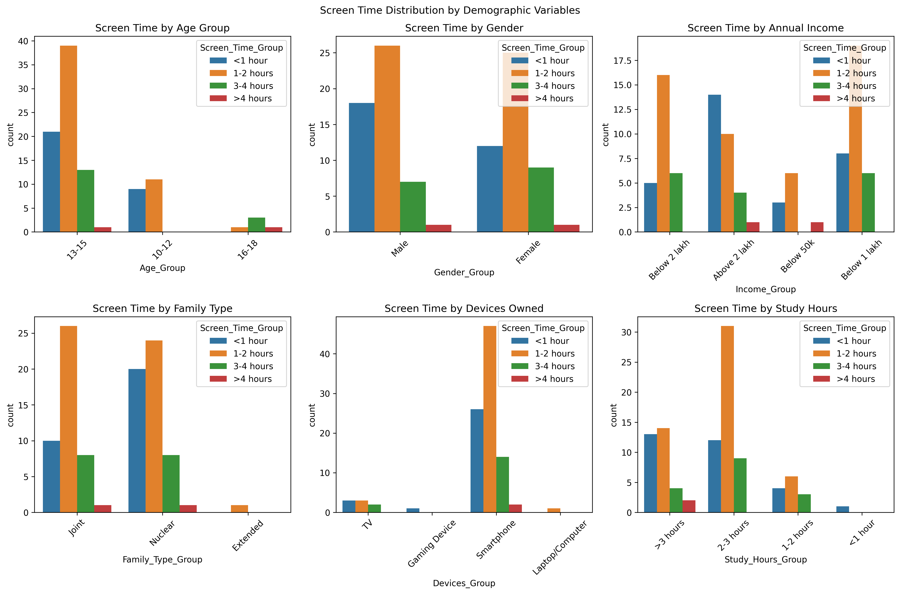

# 📊 Digital Wellbeing Analysis: Statistical Impact of Screen Time on Youth Health

-----

## 🚀 Executive Summary

  * **Business Problem:** The pervasive increase in screen time among youth is a significant concern for parents, educators, and healthcare providers. This project was initiated to statistically quantify the impact of screen time on various health domains and to identify the key demographic factors that influence screen time habits.
  * **Solution:** A comprehensive statistical analysis was performed on survey data from 99 children and adolescents. The methodology included data cleaning, feature engineering, independent t-tests, Pearson correlation, Chi-square tests of association, and multiple regression to build a holistic understanding of the issue.
  * **Key Results:** The analysis revealed that **higher screen time is statistically linked to more negative health outcomes across all measured domains** (Physical, Psychological, Academic, Social, and Habitual). **Habit patterns** showed the strongest correlation with screen time (r = 0.46). **Age** was identified as the most significant demographic factor influencing screen time levels.
  * **Tools & Skills Used:** Python | Pandas | Seaborn | Scikit-Learn | FPDF | python-docx | Statistical Analysis | Data Visualization | Automated Reporting

> This analysis provides clear, data-driven evidence that screen time duration is a critical factor in youth wellbeing, offering a foundation for targeted, age-appropriate intervention strategies.

---

## 🖥️ Interactive Dashboard

For a more dynamic and exploratory view of the findings, please visit the interactive dashboard on Tableau Public. The dashboard allows you to filter data by demographic groups and see how health impacts change accordingly.

**Dashboard Link :** (https://public.tableau.com/views/DigitalWellbeingStatisticalAnalysis/Dashboard?:language=en-US&:sid=&:redirect=auth&:display_count=n&:origin=viz_share_link)**

-----

## 🏢 Project Background

  * This project simulates a public health or academic research study aimed at understanding the consequences of digital device usage on children and adolescents (ages 10-21). As digital immersion becomes the norm, it's crucial to move beyond anecdotal evidence and provide quantifiable insights.
  * From an analyst's perspective, the objective is to translate raw survey data into actionable intelligence for stakeholders like **schools, parental groups, and policymakers**. The findings can inform educational curricula, public health campaigns, and guidelines for healthy digital habits.
  * The project culminates in a series of automated reports, including a detailed academic-style PDF and DOCX, making the findings accessible to both technical and non-technical audiences.

-----

## 🗂️ Data Structure & Initial Checks

  * **Data Source:** The data was collected via a structured survey and provided in an Excel file (`dataset_raw.xlsx`) containing two main tables.
  * **Data Structure:**
      * **Table 1: `demographic_data`** – 100 records containing participant demographics (Age, Gender, Income, etc.).
      * **Table 2: `impact_data`** – 100 records containing responses on a 5-point Likert scale to questions across five health domains.
  * **Data Quality & Cleaning:** The initial dataset of 100 records was checked for missing values. One record with a missing value in `Social_3` was dropped, resulting in a final, clean dataset of **99 records and 41 columns** (including engineered features) for analysis.

-----

## 🔎 Methodology & Approach

The project followed a structured analytical workflow:

1.  **Data Cleaning & Transformation:** Raw data from two Excel sheets was loaded, merged, and cleaned. Columns were renamed for clarity. Categorical variables were mapped to readable labels (e.g., `1` → `'10-12'`), and composite scores were engineered for each health domain by averaging responses.
2.  **Exploratory Data Analysis (EDA) & Statistical Testing:**
      * **Independent T-tests:** To compare the mean health scores of "High Screen Time" (\>2 hours/day) vs. "Low Screen Time" groups.
      * **Pearson Correlation:** To measure the strength and direction of the linear relationship between daily screen time and the five health domain scores.
      * **Chi-Square Test of Association:** To determine if there is a statistically significant association between screen time levels and key demographic variables.
3.  **Predictive Modeling:** A simple **Multiple Linear Regression** model was built to identify which demographic variables were the strongest predictors of daily screen time duration.
4.  **Automated Reporting & Visualization:** A dedicated Python script was created to automatically generate all findings into multiple formats (CSV, Excel, PNG, TXT, PDF, DOCX) to ensure the results are easily shareable and interpretable.

-----

## 📊 Insights Deep Dive

### Category 1: Impact of Screen Time on Health Domains

  * **Insight:** Participants with high screen time (\>2 hours/day) reported **statistically significant negative impacts across all five health domains** (p \< 0.05 for all tests). This confirms that increased screen time is not benign and has measurable, broad-ranging consequences.
  * **Insight:** The most pronounced negative impact was observed in **Habit Patterns** (Mean Difference = 0.82, p \< 0.0001) and **Academic Scores** (Mean Difference = 0.63, p = 0.003), suggesting these are the areas of greatest vulnerability.

### Category 2: Correlation Between Screen Time & Health

  * **Insight:** There is a **significant positive correlation** between daily screen time and negative health impact scores across all domains. This indicates a dose-response relationship: as screen time increases, negative outcomes tend to increase as well.
  * **Insight:** The strongest relationship exists between screen time and **Habit Score (r = 0.46)**, followed by Overall Health Impact (r = 0.38). This suggests that excessive screen time is most disruptive to a child's routines and habits.


### Category 3: Association with Demographics

  * **Insight:** **Age** is the only demographic variable with a statistically significant association with screen time levels (χ² = 21.90, p = 0.0013). This implies that screen time habits change significantly as a child transitions through different age groups.
  * **Observation:** Other factors like Gender, Income, and Family Type did not show a statistically significant association in this dataset, suggesting that age is a more powerful differentiating factor.

-----

## 📈 Results & Business Recommendations

  * **Results:**

    1.  **Universal Negative Impact:** High screen time is significantly associated with poorer outcomes in physical, psychological, academic, social, and habitual health domains.
    2.  **Habits and Academics are Key:** The strongest correlations and mean differences were seen in habit patterns and academic performance, highlighting these as primary areas of concern.
    3.  **Age is the Primary Driver:** Age group is the most significant demographic factor linked to different screen time patterns.

  * **Recommendations:**

    1.  **For Educators & Parents:** Develop **age-specific screen time guidelines**. A one-size-fits-all approach is insufficient. Interventions for early adolescents (13-15) should differ from those for older teens.
    2.  **For Public Health:** Launch awareness campaigns focusing on how screen time disrupts **healthy habits** (sleep, meals, chores) and negatively impacts **academic focus**, as these are the most affected areas.
    3.  **For Future Research:** Further investigate the nuances within age groups to develop more targeted and effective digital wellbeing strategies.

-----

## ⚠️ Assumptions & Caveats

  * **Self-Reported Data:** The analysis relies on self-reported survey data, which may be subject to recall bias or social desirability bias.
  * **Sample Size:** The sample size of 99 participants is relatively small, which may limit the statistical power for subgroup analyses and the generalizability of the findings.
  * **Correlation vs. Causation:** This is a cross-sectional study. While significant correlations and associations were found, they do not imply causation. A longitudinal study would be required to establish causal links.

-----

## 🔮 Next Steps & Future Work

  * **Longitudinal Study:** Track a cohort of participants over several years to understand the causal relationships between screen time and long-term health outcomes.
  * **Qualitative Analysis:** Conduct interviews or focus groups to understand the *context* behind screen time usage (e.g., educational vs. entertainment, social interaction vs. passive consumption).
  * **Expand Dataset:** Increase the sample size and diversity to allow for more robust analysis of demographic subgroups (e.g., income levels, family types).

-----

## 🛠️ Tools & Skills Demonstrated

  * **Python:** Pandas, NumPy, Seaborn, Matplotlib, Scikit-Learn
  * **Statistical Analysis:** Independent T-tests, Pearson Correlation, Chi-Square Tests, Multiple Linear Regression
  * **Automated Reporting:** FPDF, python-docx for generating professional PDF and Word documents directly from the analysis script.
  * **Data Cleaning & Feature Engineering:** Handling missing data, creating composite scores, and mapping categorical variables.

-----

## 📂 Repository Structure

```
├── .gitignore
├── LICENSE
├── README.md
├── data
    ├── processed_data
    │   ├── clean_df.csv                                # Final cleaned dataset
    │   ├── dataset.xlsx                                # Dataset after Excel preprocessing
    │   └── final_merged_dataset.csv                    # Merged dataset 
    └── raw_data
    │   └── raw_data.xlsx
├── models
    └── analysis_results.pkl                            # Pickled analysis results
├── notebooks
    ├── 01_Data_Cleaning _and_Preprocessing.ipynb
    ├── 02_Exploratory_Data_Analysis.ipynb
    ├── 03_Reporting.ipynb
    └── analysis_summary_report.txt
├── reports
    ├── Report.md
    ├── Screen_time_impact_analysis_report.docx         # Final Report (in Docx format)
    ├── analysis_summary_report.txt                     # Final Report (in txt format)
    ├── detailed_screen_time_impact_analysis_report.pdf # Final Report (in pdf format)
    ├── figures                                         # PNG visualizations
    │   ├── correlation_matrix.png
    │   ├── correlation_matrix_detailed.png
    │   ├── demographic_distribution_detailed.png
    │   └── demographic_distributions.png
    ├── final_dataset.csv                               # Some extra datasets (showing results)
    ├── regression_coefficients.csv
    ├── association_analysis.csv
    ├── correlation_analysis.csv
    ├── significance_results.csv
    └── complete_analysis_results.xlsx                  # Final Excel workbook having all final datasets
└── requirements.txt
```

-----

## 📜 References & Sources

  * Dataset Source: "Proprietary survey data collected in Q2 2025"
  * American Academy of Pediatrics. (2016). *Media and Young Minds*.
  * Twenge, J. M., & Campbell, W. K. (2018). *Associations between screen time and lower psychological well-being*.
  * World Health Organization. (2019). *Guidelines on physical activity, sedentary behaviour and sleep for children*.